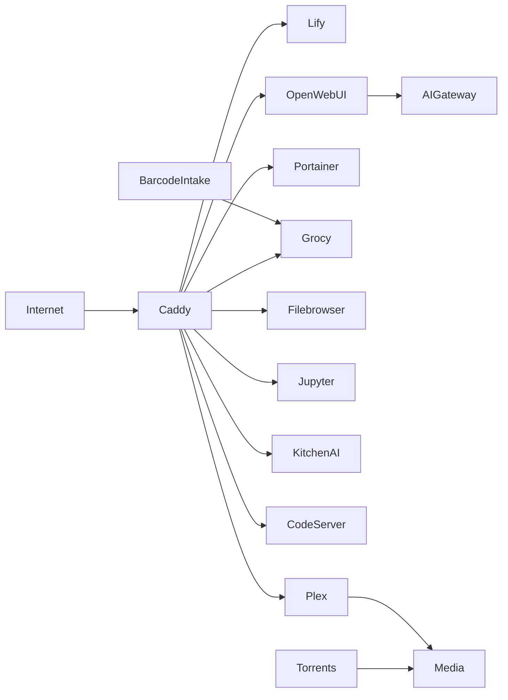

# westOS

<div align="center">

### Modular homelab platform for apps, AI, media, automation, and internal tooling

`Docker Compose` `Service-first` `Persistent data layout` `Migration-friendly`

</div>

---

## At A Glance

`westOS` is the current top-level homelab repository for the stack running under `/home/will/westOS`.

It is organized around a simple rule:

- services live in [`/home/will/westOS/services`](/home/will/westOS/services)
- durable state lives in [`/home/will/westOS/data`](/home/will/westOS/data)
- shared helpers live in [`/home/will/westOS/shared`](/home/will/westOS/shared)
- backups and migration artifacts live in [`/home/will/westOS/backups`](/home/will/westOS/backups)

> The intended workflow is per-service Compose from each service directory.  
> The root [`docker-compose.yml`](/home/will/westOS/docker-compose.yml) is transitional and should not be treated as the long-term source of truth.

---

## Navigation

- [Quick Start](#quick-start)
- [Project Layout](#project-layout)
- [Usage](#usage)
- [System Map](#system-map)
- [Service Status Matrix](#service-status-matrix)
- [Persistent Data](#persistent-data)
- [Ops Commands](#ops-commands)
- [Migration and Backups](#migration-and-backups)

---

## Quick Start

```bash
cd /home/will/westOS
```

1. Copy [`/home/will/westOS/.env.example`](/home/will/westOS/.env.example) to `.env` and fill in the required values:

```bash
cp /home/will/westOS/.env.example /home/will/westOS/.env
```

2. Start the shared edge layer:

```bash
cd /home/will/westOS/services/caddy
docker compose up -d
```

3. Start the app or service you want:

```bash
cd /home/will/westOS/services/lify && docker compose up -d
cd /home/will/westOS/services/ai-gateway && docker compose up -d --build
cd /home/will/westOS/services/openwebui && docker compose up -d
```

4. Check runtime state:

```bash
docker ps
docker compose -f /home/will/westOS/services/lify/docker-compose.yml ps
```

---

## Project Layout

```text
westOS/
├── .env
├── docker-compose.yml
├── README.md
├── backups/
│   ├── configs/
│   ├── db/
│   └── scripts/
├── data/
│   ├── filebrowser/
│   ├── grocy/
│   ├── homeassistant/
│   ├── jupyter/
│   ├── mealie/
│   ├── minecraft/
│   ├── openwebui/
│   ├── plex/
│   ├── samba/
│   └── torrents/
├── services/
│   ├── ai-gateway/
│   ├── barcode-intake/
│   ├── caddy/
│   ├── code-server/
│   ├── dashy/
│   ├── filebrowser/
│   ├── github-sync/
│   ├── grocy/
│   ├── homeassistant/
│   ├── jupyter/
│   ├── kitchen-ai/
│   ├── lify/
│   ├── mealie/
│   ├── minecraft/
│   ├── openwebui/
│   ├── plex/
│   ├── portainer/
│   ├── samba/
│   └── torrents/
└── shared/
    ├── networks/
    ├── scripts/
    └── volumes/
```

---

## Usage

<details open>
<summary><strong>Start a service</strong></summary>

```bash
cd /home/will/westOS/services/<service-name>
docker compose up -d
```

</details>

<details>
<summary><strong>Rebuild a service that has a Dockerfile</strong></summary>

```bash
cd /home/will/westOS/services/<service-name>
docker compose up -d --build
```

</details>

<details>
<summary><strong>Stop, restart, and inspect</strong></summary>

```bash
docker compose -f /home/will/westOS/services/<service-name>/docker-compose.yml down
docker compose -f /home/will/westOS/services/<service-name>/docker-compose.yml restart
docker compose -f /home/will/westOS/services/<service-name>/docker-compose.yml ps
docker compose -f /home/will/westOS/services/<service-name>/docker-compose.yml logs -f
```

</details>

<details>
<summary><strong>Working rules</strong></summary>

- Change one service at a time.
- Keep persistent state under [`/home/will/westOS/data`](/home/will/westOS/data) when practical.
- Keep service docs beside the service they describe.
- Route browser-facing traffic through Caddy.
- Back up data before changing mounts, storage paths, or networking.
- Keep real credentials in `.env`, not in committed compose files.

</details>

---

## System Map



---

## Service Status Matrix

| Service | Category | State | Access | Data |
| --- | --- | --- | --- | --- |
| `caddy` | edge | active | ports `80`, `443` | service-local |
| `lify` | app | active | `5001`, `3002`, `wnwest.com` family | service-local |
| `ai-gateway` | ai | active | `5010`, `ai.wnwest.com` | service-local |
| `openwebui` | ai | active | `chat.wnwest.com` | [`data/openwebui`](/home/will/westOS/data/openwebui) |
| `kitchen-ai` | app | active | `kitchen-ai.wnwest.com` | service-local |
| `barcode-intake` | automation | active | host input device | service-local |
| `grocy` | household | active | `pantry.wnwest.com` | [`data/grocy`](/home/will/westOS/data/grocy) |
| `mealie` | household | active | `recipes.wnwest.com` | [`data/mealie`](/home/will/westOS/data/mealie) |
| `filebrowser` | media | active | `files.wnwest.com` | [`data/filebrowser`](/home/will/westOS/data/filebrowser) |
| `plex` | media | active | host networking, `plex.wnwest.com` | [`data/plex`](/home/will/westOS/data/plex) |
| `torrents` | media | active | `8085`, `6881/tcp`, `6881/udp`, `torrent.wnwest.com` | [`data/torrents`](/home/will/westOS/data/torrents) |
| `minecraft` | games | active | `25565` | [`data/minecraft`](/home/will/westOS/data/minecraft) |
| `portainer` | ops | active | `portainer.wnwest.com` | service-local |
| `code-server` | ops | active | `code.wnwest.com` | host bind |
| `jupyter` | ops | active | `8888`, `jupyter.wnwest.com` | [`data/jupyter`](/home/will/westOS/data/jupyter) |
| `github-sync` | ops | active | scheduled sync | host bind `/home/will/repos` |
| `dashy` | ops | scaffold | not running | none |
| `homeassistant` | home | scaffold | not running | [`data/homeassistant`](/home/will/westOS/data/homeassistant) |
| `samba` | storage | scaffold | not running | [`data/samba`](/home/will/westOS/data/samba) |

---

## Persistent Data

<details open>
<summary><strong>Durable paths</strong></summary>

| Path | Used By |
| --- | --- |
| [`/home/will/westOS/data/filebrowser`](/home/will/westOS/data/filebrowser) | `filebrowser` |
| [`/home/will/westOS/data/grocy`](/home/will/westOS/data/grocy) | `grocy` |
| [`/home/will/westOS/data/homeassistant`](/home/will/westOS/data/homeassistant) | `homeassistant` |
| [`/home/will/westOS/data/jupyter`](/home/will/westOS/data/jupyter) | `jupyter` |
| [`/home/will/westOS/data/mealie`](/home/will/westOS/data/mealie) | `mealie` |
| [`/home/will/westOS/data/minecraft`](/home/will/westOS/data/minecraft) | `minecraft` |
| [`/home/will/westOS/data/openwebui`](/home/will/westOS/data/openwebui) | `openwebui` |
| [`/home/will/westOS/data/plex`](/home/will/westOS/data/plex) | `plex` |
| [`/home/will/westOS/data/samba`](/home/will/westOS/data/samba) | `samba` |
| [`/home/will/westOS/data/torrents`](/home/will/westOS/data/torrents) | `torrents` |

</details>

---

## Ops Commands

<details>
<summary><strong>Service lifecycle cheatsheet</strong></summary>

```bash
docker compose -f /home/will/westOS/services/<service>/docker-compose.yml up -d
docker compose -f /home/will/westOS/services/<service>/docker-compose.yml up -d --build
docker compose -f /home/will/westOS/services/<service>/docker-compose.yml ps
docker compose -f /home/will/westOS/services/<service>/docker-compose.yml logs -f
docker compose -f /home/will/westOS/services/<service>/docker-compose.yml down
```

</details>

<details>
<summary><strong>Examples</strong></summary>

```bash
docker compose -f /home/will/westOS/services/caddy/docker-compose.yml up -d
docker compose -f /home/will/westOS/services/ai-gateway/docker-compose.yml up -d --build
docker compose -f /home/will/westOS/services/openwebui/docker-compose.yml logs -f
docker compose -f /home/will/westOS/services/torrents/docker-compose.yml ps
```

</details>

---

## Migration and Backups

<details>
<summary><strong>Backup structure</strong></summary>

- [`/home/will/westOS/backups/configs`](/home/will/westOS/backups/configs)
- [`/home/will/westOS/backups/db`](/home/will/westOS/backups/db)
- [`/home/will/westOS/backups/scripts`](/home/will/westOS/backups/scripts)
- [`/home/will/westOS/shared/scripts/migrate_homelab_to_westos.sh`](/home/will/westOS/shared/scripts/migrate_homelab_to_westos.sh)

</details>

<details>
<summary><strong>Migration pattern</strong></summary>

1. Create the service under [`/home/will/westOS/services`](/home/will/westOS/services).
2. Move durable state into [`/home/will/westOS/data`](/home/will/westOS/data) when appropriate.
3. Confirm mounts, ports, networks, and reverse-proxy routes.
4. Start the migrated service and validate behavior.
5. Remove the legacy version only after the new one is verified.

</details>

---

## Related Docs

- [`/home/will/westOS/services/README.md`](/home/will/westOS/services/README.md)
- [`/home/will/westOS/services/caddy/README.md`](/home/will/westOS/services/caddy/README.md)
- [`/home/will/westOS/services/lify/README.md`](/home/will/westOS/services/lify/README.md)
- [`/home/will/westOS/services/ai-gateway/README.md`](/home/will/westOS/services/ai-gateway/README.md)
